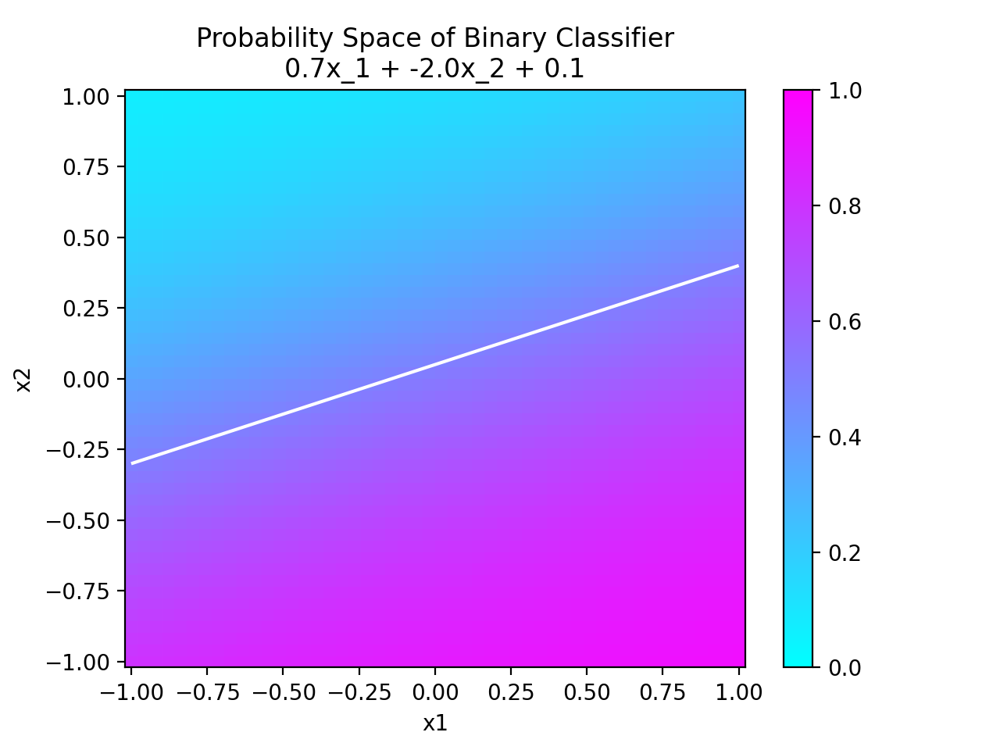

# log-reg-visualizer
A simple interactive display of probability space for a half-space classifier trained on two features.
```python
python visualizer.py
```
*Requires: numpy, matplotlib*

<!-- include image example.png -->
